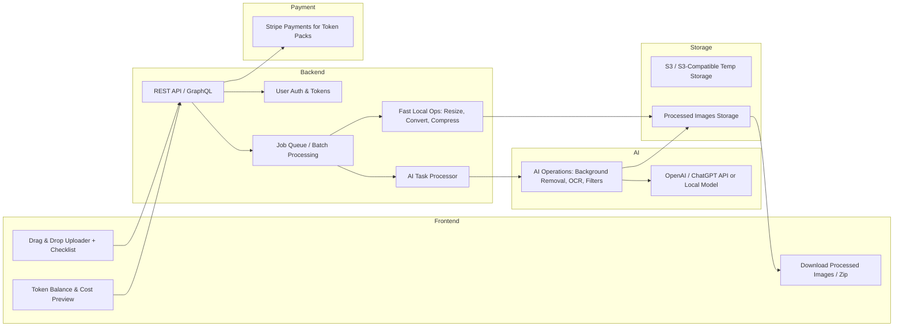

## ImageSwiss Architecture & Roadmap

### 1. Architecture Overview

### 2. Roadmap (Solo Dev / Part-Time)

**Phase 0: Planning & Validation (Week 1–2)**
- Finalize PRD & feature checklist
- Landing page / email capture
- Tech stack selection
- Draft token model

**Phase 1: Core Fast Operations (Week 3–6)**
- Upload & download flow
- Fast Local Ops: Resize, Format Conversion, Compress
- Batch upload support
- Zip download
- Internal testing

**Phase 2: Token System (Week 7–9)**
- User auth (email / OAuth)
- Token accounting & cost preview
- Stripe integration
- Token balance UI
- Edge cases handling

**Phase 3: AI Trial Operations (Week 10–12)**
- AI Ops: Background removal, OCR, filters
- Fast trial: high token, quick
- Slow batch: low token, asynchronous
- Queue system & notifications

**Phase 4: MVP Polishing & Launch (Week 13–16)**
- UI/UX polish, progress bars, job status
- Email notifications for batch jobs
- Error logging & monitoring
- Beta launch (10–20 users)
- Collect feedback & fix issues

**Phase 5: Post-MVP / Optional Features (Month 5–6)**
- Developer API
- Zapier / Make integrations
- Analytics dashboard
- Advanced AI-powered utilities
- Marketing ramp-up: blog posts, SEO, community launch

